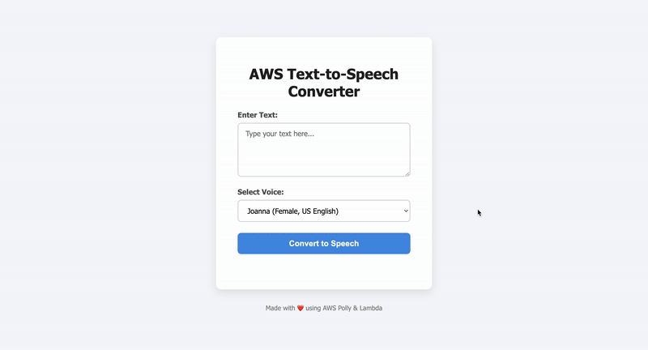

# 🎙️ AWS Text-to-Speech Converter

**Technologies:** `HTML`, `CSS`, `JavaScript`, `Python`, `AWS Lambda`, `Amazon Polly`, `Amazon S3`, `API Gateway`

---

This is a serverless text-to-speech web application that converts user input text into speech audio using **AWS Polly**. The frontend is a simple, elegant webpage that communicates with a Python-based AWS Lambda backend. The backend synthesizes speech, stores the audio in an S3 bucket, and returns a public audio URL for playback and download.

---

## ✨ Key Features

- User inputs text and selects a voice for speech synthesis  
- Backend synthesizes speech via AWS Polly and saves MP3 to S3  
- Audio URL is returned and played back in the browser  
- Clean, responsive, and modern UI  
- Fully serverless architecture with API Gateway and Lambda  

---

## 🧠 What I Learned

- 🐍 Writing AWS Lambda functions in **Python** with `boto3`  
- 🧩 Integrating AWS Polly text-to-speech in a serverless environment  
- 🗄 Managing S3 buckets and permissions programmatically  
- 🌐 Setting up CORS on API Gateway for frontend-backend communication  
- 🎨 Designing a user-friendly frontend with HTML, CSS, and JavaScript  
- ⚙️ Handling REST API requests and responses using AWS API Gateway  

---

## 🔧 Improvements & Future Enhancements

- Add more voice options and languages  
- Include a loading indicator during speech synthesis  
- Support for longer texts and streaming audio playback  
- Add user authentication to save favorite voices or texts  

---

## 📦 Tech Stack

| Layer         | Technology                          |
|---------------|-----------------------------------|
| 🎨 Frontend    | `HTML`, `CSS`, `JavaScript`       |
| 🧠 Backend     | `Python`, `AWS Lambda`, `boto3`     |
| ☁️ Cloud      | `Amazon Polly`, `Amazon S3`, `API Gateway` |
| 🔐 Security    | `IAM Roles`, `CORS Configuration`     |

---

## ⚙️ Architecture Overview

1. User inputs text and voice choice on the frontend page  
2. Frontend sends a POST request with JSON payload to API Gateway endpoint  
3. API Gateway triggers the Python Lambda function  
4. Lambda calls Amazon Polly to synthesize speech, stores MP3 in S3  
5. Lambda returns the public S3 URL of the MP3 audio  
6. Frontend receives URL, plays audio, and shows download link  

---

## 📝 Usage

1. Clone the repo or download the frontend files  
2. Deploy the Lambda function with proper IAM role and S3 bucket  
3. Set up API Gateway with POST and OPTIONS methods and CORS enabled  
4. Configure frontend `apiUrl` to your API Gateway endpoint  
5. Open `index.html` in a browser, enter text, select voice, and convert!  

---

## 📄 License

MIT License © 2025  
Feel free to fork, improve, and deploy your own version!

---

Thanks for checking out the project!
